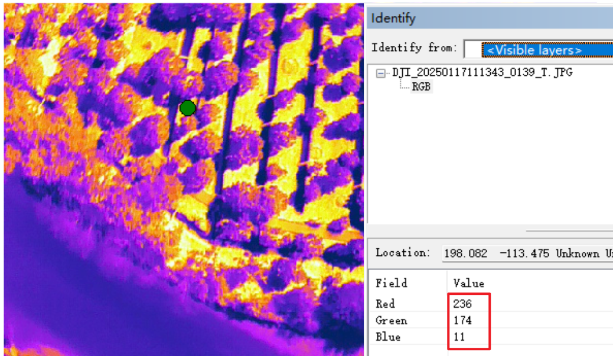
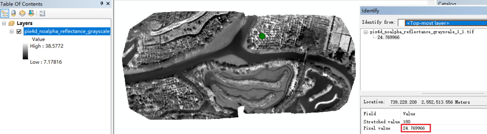

# DJI 热红外图像处理（转换、拼接）教程

## 前情提要

### DJI热红外照片的缺点
DJI拍摄的热红外照片的像素点上并没有直接保存温度信息，无法直接获取温度信息

>获取温度信息最简单的方法是采用DJI官方的[大疆红外热分析工具3](https://www.dji.com/cn/downloads/softwares/dji-dtat3)，但是功能仍然十分有限，无法满足多样的实际需求，如自定义区域测温或与其他图像进行配准等

### DJI Thermal SDK

可通过官方SDK来自定义分析、处理红外照片，直接获取照片上每个点的温度信息

>DJI官方开放了[DJI Thermal SDK](https://www.dji.com/cn/downloads/softwares/dji-thermal-sdk)，可以让用户可以在Windows或Linux中借助该SDK开发出自己的专用软件，实现对R-JPEG红外照片的处理和温度测量等功能

## 概述

本教程用于展示如何处理DJI热红外相机拍摄的图像数据（型号支持M2EA、M30T等），并将图像导入Pix4Dmapper中进行正射拼接

### 图像转换并提取每张图像的地理信息数据

将DJI热红外相机拍摄的JPG图像转换为带温度信息的TIFF格式图像，并从图像中提取包含GPS坐标和POS信息的地理信息数据，便于后续导入航测软件（Pix4Dmapper）进行拼接，用于后续的热/温度分析

>以下是转换前后的对比，可以看到，转换前的JPG图像每个像素代表的是该像素的RGB值，无法得到该点具体的温度数值，而转换后的图像，每个像素代表的则是该像素的值，也就是物体表面辐射温度，转换原理详见[TSDK（Thermal SDK）常见问题汇总（持续更新）](https://bbs.dji.com/pro/detail?tid=290236)




>图像的地理信息数据提取功能与大疆智图的pos数据导出功能类似，详见[大疆智图“影像 POS 数据”功能介绍](https://support.dji.com/help/content?customId=zh-cn03400005094&spaceId=34&re=CN&lang=zh-CN&documentType=artical&paperDocType=paper)），得到的pos数据文件为txt文件，pos数据可用于将图像进行更精确的地理定位、畸变矫正，最后图像的拼接效果如下图



## 使用

### 图像数据收集

>由于物体表面温度在一天内会持续快速变化，且无人机拍摄得到的照片存在时间间隔（即照片A和照片B的时间相差可能很久，甚至超过1小时），用于拼接的红外照片最好是时间连续且时间跨度不宜过长。为此，需要根据实际需要采集数据的面积调整各项飞行参数（如飞行高度、正侧向重叠率、飞行速度等，简单来说，在相同的时间内，飞得越高、重叠率越低、飞行速度越快，所能够采集数据的面积就越大，但会因此损失图像的精度，详见[Selecting the Image Acquisition Plan Type - PIX4Dmapper](https://support.pix4d.com/hc/en-us/articles/115002471546)。以下是推荐参数:

- 用于拼接的图像的时间跨度 ≤ 1小时

- 正侧向重叠率 ≥ 80%或90%

- 云台角度 = 90°，即垂直于地平面拍摄

- 飞行速度 ≤ 4m/s，太快会导致运动模糊，或者拍摄时设置为悬停拍摄

- 飞行高度可根据实际情况设置，推荐值：100m~120m

### 下载安装

供参考，版本号非必须相同

- Python3，从官网下载安装：https://www.python.org/downloads/

- Pycharm，从官网下载安装：https://www.jetbrains.com/pycharm/

- Anaconda或Miniconda，从官网下载安装：https://www.anaconda.com/

- Pix4Dmapper，可申请试用，从官网下载安装：https://www.pix4d.com/product/pix4dmapper-photogrammetry-software/

### 文件准备

新建项目文件夹，同时确保项目文件夹结构如下：

```
project_folder
└── main/
    └── subfolder_01/
        └── DJI_20250117111343_0139_T.JPG
        └── DJI_YYYYMMDDHHMMSS_xxxx_T.JPG
        └── ......
    └── subfolder_02/
        └── DJI_YYYYMMDDHHMMSS_xxxx_T.JPG
        └── DJI_YYYYMMDDHHMMSS_xxxx_T.JPG
        └── ......
└── extract_metadata.py
└── jpg2tiff&pos_edit.py
└── rename_tiff2jpg.py
└── dji_thermal_sdk_v1.5_20240507/
└── environment.yml
```

### conda环境配置

第1步：运行Anaconda Prompt

- 打开"Anaconda Prompt"窗口

第2步：输入以下指令，切换到包含environment.yml文件的目录

```bash
cd /d c:/your_project_folder 
```

`c:/your_project_folder`为项目文件夹路径，请根据实际情况修改

第3步：创建新的conda环境

```bash
conda env create -f environment.yml
```

或

```bash
conda env create -f environment.yml -n dji_thermal_2
```

- 注：`dji_thermal_2`可以修改为自定义的conda环境名称

第4步：激活新创建的环境

```bash
conda activate dji_thermal_2
```

第5步：验证环境是否正确创建

```bash
conda list
```

- 这个命令会显示当前环境中安装的所有包
- 确认是否包含了environment.yml中指定的所有包

注意事项：
1. 创建环境时请确保网络连接正常
2. 如果某些包安装失败，可能需要单独使用`pip install`安装

### 运行py脚本文件

在Pycharm中配置conda环境，并按顺序依次运行如下脚本文件

- extract_metadata.py
- jpg2tiff&pos_edit.py
- rename_tiff2jpg.py

### 输出结果

处理后， `main` 文件夹下的每个子文件夹的文件结构如下：

```
main/
└── subfolder_01/
    └── input_dir/  # 包含原始图像
        └── DJI_20250117111343_0139_T.JPG
        └── DJI_YYYYMMDDHHMMSS_xxxx_T.JPG
        └── ......
    └── out_dir/    # 包含转换后的jpg图像（以灰度值显示温度信息）
        └── DJI_20250117111343_0139_T.jpg
        └── DJI_YYYYMMDDHHMMSS_xxxx_T.jpg
        └── ......
    └── pos/        # 包含pos.txt文件和posT.txt文件
        └── pos.txt
        └── posT.txt
```

### 在Pix4Dmapper中进行拼接

与一般的Pix4Dmapper重建项目操作类似，但需要注意：

- 将`out_dir`文件夹中的jpg图像导入Pix4Dmapper项目中

- 选择`pos`文件夹中的posT.txt文件作为定位信息文件

- 处理模板选择`Thermal Camera`

- 若多次拼接失败，可在菜单栏中，点击“处理”>“处理选项”，在弹出的“处理选项”对话框中将“关键点图像比例”设置为1/2、1/4或1/8，进行多次尝试。详细原理见[Menu Process > Processing Options... > 1. Initial Processing > General - PIX4Dmapper](https://support.pix4d.com/hc/en-us/articles/202557759)

