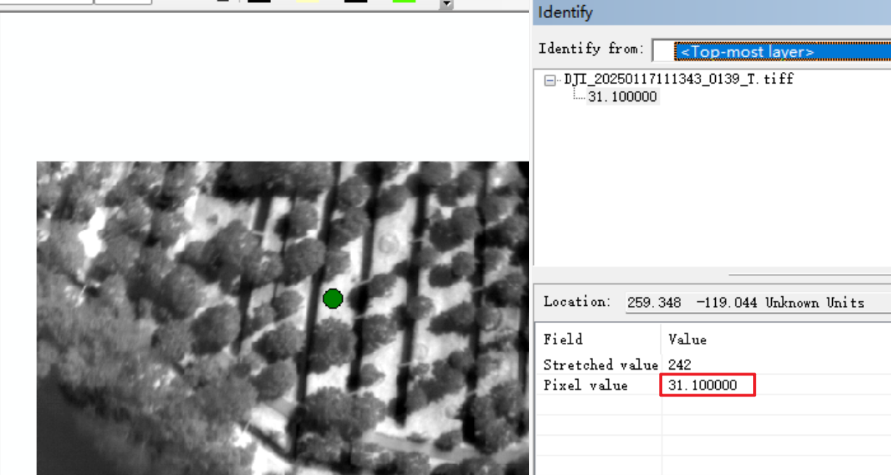

# DJI Thermal Image Processing (Conversion & Stitching) Tutorial

[切换到中文版](README.md)

## Background

### Limitations of DJI Thermal Images
DJI thermal photos do not directly store temperature information in their pixels, making it impossible to directly obtain temperature data

>The simplest way to obtain temperature information is to use DJI's official [DJI Thermal Analysis Tool 3](https://www.dji.com/downloads/softwares/dji-dtat3). However, its functionality remains quite limited and cannot meet diverse practical needs such as custom area temperature measurement or registration with other images.

### DJI Thermal SDK

Custom analysis and processing of thermal photos to directly obtain temperature information for each point in the photo can be done through the official SDK.

>DJI has released the [DJI Thermal SDK](https://www.dji.com/downloads/softwares/dji-thermal-sdk), allowing users to develop their own specialized software on Windows or Linux platforms to process R-JPEG thermal photos and perform temperature measurements.

Note: This project includes only the core functionality files of the DJI Thermal SDK. For the complete SDK, please download from the official website. The retained files include:
- Core API files (tsdk-core/api/)
- Windows 64-bit runtime libraries (tsdk-core/lib/windows/release_x64/)
- Windows 64-bit executables (utility/bin/windows/release_x64/)
- License file (License.txt)
- Basic documentation (Readme.md)

## Overview

This tutorial demonstrates how to process thermal image data captured by DJI thermal cameras (supporting models like M2EA, M30T, etc.) and import the images into Pix4Dmapper for orthomosaic stitching.

### Image Conversion and Geographic Information Data Extraction

Convert JPG images captured by DJI thermal cameras into TIFF format images with temperature information, and extract geographic information data including GPS coordinates and POS information from the images. This facilitates subsequent import into photogrammetry software (Pix4Dmapper) for stitching, enabling thermal/temperature analysis.

>Here's a comparison before and after conversion. As shown, before conversion, each pixel in the JPG image represents its RGB value, making it impossible to obtain the specific temperature value. After conversion, each pixel represents the surface radiation temperature of the object. For more details on the conversion principle, see [TSDK (Thermal SDK) FAQ (Continuously Updated)](https://bbs.dji.com/pro/detail?tid=290236)




>The geographic information data extraction function is similar to DJI Terra's POS data export function (see [DJI Terra "Image POS Data" Feature Introduction](https://support.dji.com/help/content?customId=en03400005094&spaceId=34&re=Global&lang=en&documentType=article&paperDocType=paper)). The resulting POS data file is in TXT format. POS data can be used for more accurate image geolocation and distortion correction. The final image stitching result is shown below:


## Usage

### Image Data Collection

>Since surface temperatures change rapidly throughout the day, and there are time intervals between drone-captured photos (i.e., there might be a significant time difference, even over an hour, between photos A and B), thermal images used for stitching should be temporally continuous with minimal time span. Therefore, various flight parameters need to be adjusted based on the actual area requiring data collection (such as flight altitude, forward/side overlap ratio, flight speed, etc. Simply put, within the same time frame, flying higher, with lower overlap ratio, and faster speed allows covering a larger area but sacrifices image accuracy. For details, see [Selecting the Image Acquisition Plan Type - PIX4Dmapper](https://support.pix4d.com/hc/en-us/articles/115002471546). Here are the recommended parameters:

- Time span for images to be stitched ≤ 1 hour
- Forward/side overlap ratio ≥ 80% or 90%
- Gimbal angle = 90°, i.e., shooting perpendicular to the ground
- Flight speed ≤ 4m/s (too fast causes motion blur), or hover while shooting
- Flight altitude can be set according to actual conditions, recommended: 100m~120m

### Download and Installation

For reference, version numbers need not be identical

- Python3, download and install from official website: https://www.python.org/downloads/
- PyCharm, download and install from official website: https://www.jetbrains.com/pycharm/
- Anaconda or Miniconda, download and install from official website: https://www.anaconda.com/
- Pix4Dmapper, trial version available, download and install from official website: https://www.pix4d.com/product/pix4dmapper-photogrammetry-software/

### File Preparation

Create a new project folder and ensure the project folder structure is as follows:

```
project_folder
└── main/
    └── subfolder_01/
        └── DJI_20250117111343_0139_T.JPG
        └── DJI_YYYYMMDDHHMMSS_xxxx_T.JPG
        └── ......
    └── subfolder_02/
        └── DJI_YYYYMMDDHHMMSS_xxxx_T.JPG
        └── DJI_YYYYMMDDHHMMSS_xxxx_T.JPG
        └── ......
└── extract_metadata.py
└── jpg2tiff&pos_edit.py
└── rename_tiff2jpg.py
└── dji_thermal_sdk_v1.5_20240507/
└── environment.yml
```

### Conda Environment Configuration

Step 1: Run Anaconda Prompt

- Open "Anaconda Prompt" window

Step 2: Enter the following command to switch to the directory containing environment.yml

```bash
cd /d c:/your_project_folder
```

`c:/your_project_folder` is your project folder path, please modify according to actual situation

Step 3: Create new conda environment

```bash
conda env create -f environment.yml
```

or

```bash
conda env create -f environment.yml -n dji_thermal_2
```

- Note: `dji_thermal_2` can be modified to a custom conda environment name

Step 4: Activate the newly created environment

```bash
conda activate dji_thermal_2
```

Step 5: Verify environment creation

```bash
conda list
```

- This command displays all packages installed in the current environment
- Confirm that all packages specified in environment.yml are included

Notes:
1. Ensure network connection is stable when creating environment
2. If some packages fail to install, you may need to install them separately using `pip install`

### Running Python Scripts

Configure conda environment in PyCharm and run the following script files in order:

- extract_metadata.py
- jpg2tiff&pos_edit.py
- rename_tiff2jpg.py

### Output Results

After processing, the file structure in each subfolder under the `main` folder is as follows:

```
main/
└── subfolder_01/
    └── input_dir/  # Contains original images
        └── DJI_20250117111343_0139_T.JPG
        └── DJI_YYYYMMDDHHMMSS_xxxx_T.JPG
        └── ......
    └── out_dir/    # Contains converted jpg images (displaying temperature information as grayscale values)
        └── DJI_20250117111343_0139_T.jpg
        └── DJI_YYYYMMDDHHMMSS_xxxx_T.jpg
        └── ......
    └── pos/        # Contains pos.txt and posT.txt files
        └── pos.txt
        └── posT.txt
```

### Stitching in Pix4Dmapper

Similar to general Pix4Dmapper reconstruction projects, but note:

- Import jpg images from the `out_dir` folder into the Pix4Dmapper project
- Select posT.txt from the `pos` folder as the positioning information file
- Choose `Thermal Camera` as the processing template
- If multiple stitching attempts fail, click "Process" > "Processing Options" in the menu bar, in the "Processing Options" dialog that appears, set "Keypoints Image Scale" to 1/2, 1/4, or 1/8, and try multiple times. For detailed principles, see [Menu Process > Processing Options... > 1. Initial Processing > General - PIX4Dmapper](https://support.pix4d.com/hc/en-us/articles/202557759)